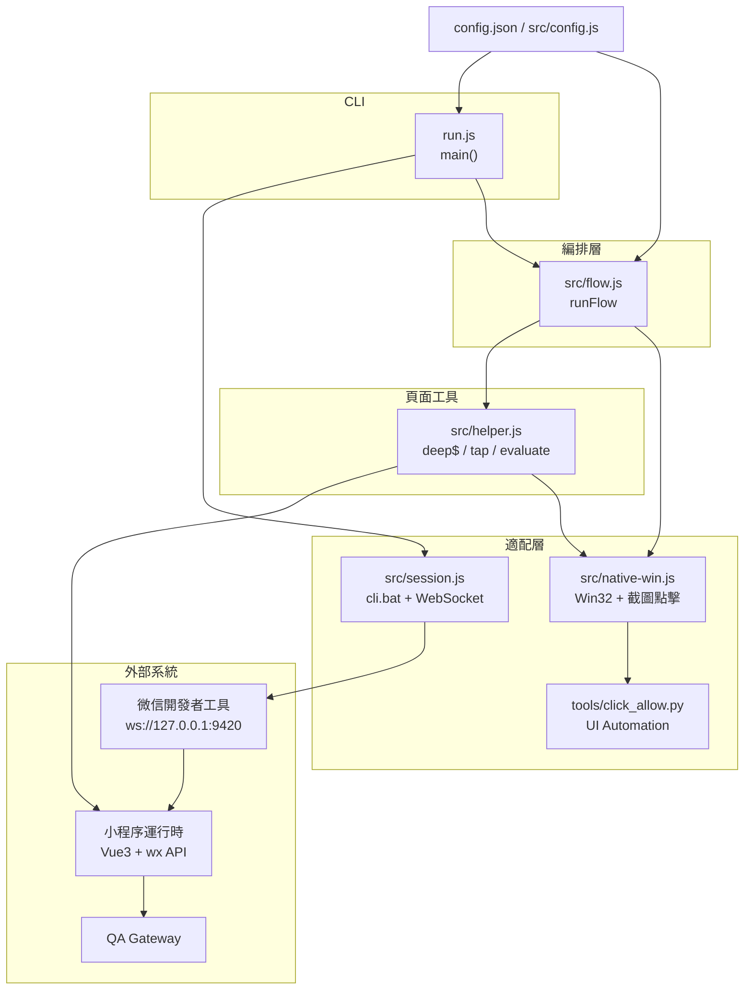
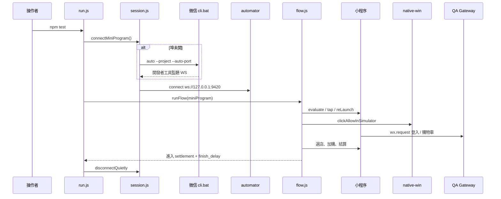
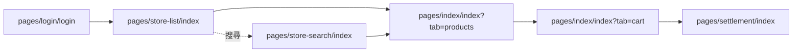

# aChill Club 小程序 QA 自動化 — 架構設計說明

本文件依目前程式與技術棧整理，說明 `achill-miniprogram-automator` 如何驅動 aChill Club（Peterson）微信小程序，跑完登入到結算頁的 E2E happy path。

被測小程序原始碼不在本 repo，預設編譯產物由 `config.json` 的 `projectPath` 指向：

`F:\azure\Peterson\src\Peterson.WechatMiniProgram\PetersonWechatMiniProgram-vue3vite\dist\dev\mp-weixin`

對應 Vue 原始碼目錄：

`...\PetersonWechatMiniProgram-vue3vite\src`

---

## 1. 定位與目標

這是本機 **Windows CLI 腳本**，不是 Web 服務、測試框架或 CI runner。`npm test` 等於 `node run.js`。

| 目標 | 作法 |
|------|------|
| 穩定重跑「登入 → 選店 → 加購 → 結算」 | 單一編排出口 `runFlow`，步驟失敗即 `throw` |
| 同時打穿小程序邏輯層與原生彈窗 | Automator 操作頁面；Win32 / Python 點「允許」 |
| 結束後不關掉開發者工具 | 只 `disconnect` WebSocket |
| 本機路徑可改、業務常量集中 | `config.json` 管路徑與埠；`src/config.js` 管 QA URL、頁面 path、目標店 |

範圍到 `pages/settlement/index` 為止，**不走微信支付**。

---

## 2. 技術棧

| 層 | 技術 | 用途 |
|----|------|------|
| Runtime | Node.js ≥ 18、CommonJS | CLI 主程式 |
| 小程序自動化 | `miniprogram-automator` ^0.12.1 | WebSocket 連開發者工具，操作 Page / `wx.*` |
| 原生綁定 | `koffi` → `user32.dll` / `gdi32.dll` / `kernel32.dll` | 找模擬器視窗、截圖、滑鼠、滑動 |
| 授權彈窗 | Python `uiautomation`（`tools/click_allow.py`） | 點原生「允許」 |
| 被測 UI | 微信開發者工具模擬器 | uni-app Vue3 編譯產物 |
| 後端 | `https://peterson-gw-qa.weprogram.site` | 登入、購物車 API |

未使用 Playwright、Selenium、Jest、Docker、HTTP 服務、資料庫。

---

## 3. 專案結構

```
QA/
├── run.js                 # CLI 入口
├── config.json            # 本機路徑、埠、結束等待
├── package.json
├── docs/
│   └── architecture.md    # 本文件
├── src/
│   ├── config.js          # 讀 JSON + QA / 頁面常量
│   ├── session.js         # 開發者工具連線
│   ├── flow.js            # 12 步業務編排
│   ├── helper.js          # 頁面查詢 / 點擊 / 等待
│   └── native-win.js      # Windows 桌面自動化
└── tools/
    └── click_allow.py     # UI Automation 點「允許」
```

---

## 4. 邏輯分層



依賴方向由上而下：入口只呼叫連線與編排；編排透過 helper 碰頁面、透過 native-win 碰 OS；session 不碰業務。

---

## 5. 模組設計

### 5.1 入口 `run.js`

生命週期固定為：連線 → 跑流程 → `finally` 安靜斷開。失敗設 `process.exitCode = 1`，不斷開開發者工具視窗。

### 5.2 連線 `src/session.js`

- 埠已開：直接 `automator.connect({ wsEndpoint })`
- 埠未開：`cli.bat auto --project … --auto-port`，最多等 120 秒
- `disconnectQuietly` 只斷 WS

### 5.3 編排 `src/flow.js`

唯一匯出 `runFlow(miniProgram)`。內部注入 `__pageSetup()`，用 `getRef` / `setRef` / `callFn` 讀寫 Vue3 Composition API 狀態。

補償路徑 `retryWechatLogin`：UI 授權成功但 storage 沒寫入 token 時，用先前 hook 到的 `phoneCode` + `wx.login` 直接 POST `/api/auth/wechat/login`。

### 5.4 頁面工具 `src/helper.js`

Page Object 風格，不綁單一頁面類別：

- 導航：`currentPage`、`waitPath`、`waitUntil`
- 互動：`click`、`gestureTap`、`osTapElement`（轉螢幕座標）
- 組件樹：`COMP_TAGS` + `walkHosts` / `deep$` / `deep$$`
- Mock：`restoreLeftoverMocks` 把 `getLocation` 設成澳門附近座標

### 5.5 原生適配 `src/native-win.js` + `click_allow.py`

手機號「允許」在模擬器原生層，automator 點不到。`clickAllowInSimulator` 採多層 fallback：

1. 視窗截圖，聚類綠色按鈕再點
2. Python UI Automation 找「允许」
3. 依視窗比例猜座標連點

UIA 超時會設 `skipUia`，後續改走截圖路徑。

---

## 6. 執行資料流



---

## 7. 業務流程（12 步）

`runFlow` 實際呼叫順序：

| # | 函式 | 行為 |
|---|------|------|
| 1 | `assertWxLogin` | 確認 `wx.login` 仍是 function（開發者工具需先「編譯」） |
| 2 | `openLogin` | 清登入態，進 `pages/login/login` |
| 3 | `chooseQa` | `switchApiBase` + storage `api_base` |
| 4 | `agreeTerms` | 勾協議 |
| 5 | `wechatLogin` | 點一鍵登錄，hook console / `wx.request` |
| 6 | `allowPhoneNumber` | OS 點「允許」，必要時 `retryWechatLogin` |
| 7 | `waitLoggedInHome` | 等 token / 首頁，處理綁手機 |
| 8 | `openStoreList` | 進門店列表 |
| 9 | `chooseStore` | 鎖定「aChill Club澳门直营店」 |
| 10 | `addProduct` | 加 2–3 件 |
| 11 | `openCart` | 開購物車 |
| 12 | `verifyCartAndCheckout` | 勾選並進結算頁，不支付，再等 `finish_delay`（預設 15 秒） |

---

## 8. 三條操作通道

| 通道 | 能力 | 使用時機 |
|------|------|----------|
| A. Automator | `tap` / `evaluate` / `callWxMethod` / `reLaunch` | 頁面與 `wx` API |
| B. Vue 注入 | `__pageSetup` 調 VM 方法 | DOM 不穩、需改 ref（切 QA、購物車 `checkout`） |
| C. OS 原生 | 螢幕座標、滑動、UIA | 原生授權框、列表滑動 |

同一動作常雙通道：先邏輯層，失敗再實體點擊。

---

## 9. 設定模型

**本機可變（`config.json`）**

| 鍵 | 用途 |
|----|------|
| `cliPath` | 微信開發者工具 `cli.bat` |
| `projectPath` | 小程序編譯目錄 |
| `test_port` | 自動化埠（預設 9420） |
| `finish_delay` | 結算頁停留秒數 |

別名：`dev_tool_path`、`project_path`。

**業務常量（`src/config.js` 硬編碼）**

- `qaApi`、`preferredStore` / `preferredHints`
- `pages.login | home | storeList | storeSearch | settlement`

沒有 `.env` 或 secrets 檔；token 來自執行期小程序 storage。

---

## 10. 設計手法

1. **單一編排出口** — 場景只從 `runFlow` 進出
2. **適配隔離** — 開發者工具與 Win32 不進業務步驟
3. **授權多層 fallback** — 視覺 → UIA → 比例座標
4. **自訂組件遍歷** — 模擬 shadow / 宿主穿透
5. **可觀測 hook** — console 解析 `PHONE_EVENT` / `WX_RESP`
6. **補償交易** — UI 成功、token 未寫入時走 API 補登
7. **輪詢重試** — `waitUntil`、選店滾動 / VM / 搜尋多策略

---

## 11. 執行模型與邊界

| 項目 | 現況 |
|------|------|
| 形態 | 本機 CLI，單次執行 |
| OS | **僅 Windows** |
| 前置 | Node 18+、開發者工具開「服務端口」、小程序已編譯、建議先點一次「編譯」 |
| CI | 未配置；依賴 GUI 模擬器，不適合無頭環境 |
| 測試 | 無單元測試目錄；斷言即流程中的 `throw` |
| 範圍 | 到結算頁為止，不含支付 |

---

## 12. 與 Peterson 小程序頁面 / 組件對照

小程序為 uni-app Vue3。頁面路由以 `src/pages.json` 為準；自訂組件在編譯後多為 kebab-case 標籤（`HomeTab.vue` → `home-tab`）。QA 腳本透過 `helper.js` 的 `COMP_TAGS` 穿透這些宿主。

### 12.1 流程覆蓋的頁面

| 小程序 path | Vue 原始檔 | QA 常量 / 函式 | 流程角色 |
|-------------|------------|----------------|----------|
| `pages/login/login` | `src/pages/login/login.vue` | `config.pages.login`、`openLogin` | 選 QA、勾協議、微信一鍵登錄 |
| `pages/index/index` | `src/pages/index/index.vue` | `config.pages.home` | 主殼：home / products / cart / profile Tab |
| `pages/index/index?tab=products` | 同上，`currentTab = products` | `goToOrder` 成功後 `reLaunch` | 菜單加購 |
| `pages/index/index?tab=cart` | 同上，`currentTab = cart` | `openCartPage` | 購物車勾選與結算 |
| `pages/store-list/index` | `src/pages/store-list/index.vue` | `config.pages.storeList`、`openStoreList` | 找澳門直營店 |
| `pages/store-search/index` | `src/pages/store-search/index.vue` | `config.pages.storeSearch`、`searchPreferredStore` | 列表找不到店時搜尋 |
| `pages/settlement/index` | `src/pages/settlement/index.vue` | `config.pages.settlement`、`verifyCartAndCheckout` | 流程終點（不支付） |

登入成功後，小程序 `navigateAfterLogin` 可能 `reLaunch` 門店列表或 `redirectTo` 首頁；QA 會再主動進門店列表以鎖定目標店。

### 12.2 本流程未覆蓋、但存在於小程序的頁面

`product-details`、`product-search`、`member-center`、`order-list`、`order-detail`、`payment-success`、`coupon-list`、`balance`、`profile-info`、`settings`、`agreement/user`、`agreement/privacy` 等。結算之後的支付成功頁不在自動化範圍。

### 12.3 組件標籤 ↔ Vue 檔 ↔ QA 用途

`COMP_TAGS`（`src/helper.js`）與 Peterson 組件對應：

| 編譯後標籤 | Vue 原始檔 | 所在頁 / 父組件 | QA 用途 |
|------------|------------|-----------------|---------|
| `home-tab` | `components/home/HomeTab.vue` | `pages/index` | 找「更多」進門店列表 |
| `products-tab` | `components/products/ProductsTab.vue` | `pages/index` | 菜單 Tab、加購入口 |
| `products-sidebar` | `components/products/ProductsSidebar.vue` | ProductsTab | 左側分類 `.sidebar-item` |
| `product-list` | `components/products/ProductList.vue` | ProductsTab | 商品列表宿主 |
| `products-list-item` | `components/products/ProductsListItem.vue` | ProductList | 列上的 `+`（`.plus-btn`） |
| `product-purchase-popup` | `components/shared/ProductPurchasePopup.vue` | ProductsTab / CartTab | 「加入购物车」`.add-cart` |
| `cart-tab` | `components/cart/CartTab.vue` | `pages/index` | `selectComponent('cart-tab')` 調 `toggleAll` / `checkout` |
| `cart-item-row` | `components/cart/CartItemRow.vue` | CartShopGroup | 判斷購物車有商品 |
| `cart-shop-group` | `components/cart/CartShopGroup.vue` | CartTab | 店鋪分組 |
| `cart-summary-bar` | `components/cart/CartSummaryBar.vue` | CartTab | 底欄「结算」`.action-btn` |
| `bottom-tabbar` | `components/common/BottomTabbar.vue` | `pages/index` | `.tab-item` / `.tab-text` 切 Tab |
| `store-list-item` | `components/store/StoreListItem.vue` | store-list / store-search | 門店卡片 `.store-card` |
| `search-nav-bar` | `components/common/SearchNavBar.vue` | 多頁頂欄 | 搜尋入口 |

首頁殼層還有 `ProfileTab.vue`，本流程不操作「我的」。

### 12.4 選擇器 / 文案 ↔ 小程序 DOM

| QA 選擇器或文案 | 小程序來源 | 步驟 |
|-----------------|------------|------|
| `.api-switcher__button`、文字 `QA` | `login.vue` 環境切換按鈕 | `chooseQa` |
| `.check-circle`、`我已阅读并同意` | `login.vue` 協議勾選 | `agreeTerms` |
| `.wechat-login-btn`、`微信一键登录` | `login.vue` `open-type="getPhoneNumber"` | `wechatLogin` |
| 原生綠色「允许」 | 開發者工具 / 模擬器授權框 | `allowPhoneNumber`（OS 層） |
| `.phone-popup-btn`、`微信一键绑定` | `pages/index` 補綁手機彈窗 | `ensurePhoneBound` |
| `.phone-popup-skip` | 同上略過鈕 | `closeBindPopup` |
| `.tab-text` / `.tab-item` | `BottomTabbar.vue` | `tapTab` / `switchMainTab` |
| 文字 `更多` | `HomeTab.vue` | `openStoreList` |
| `.store-list`、`.store-card` | 門店列表頁 | `enterMacauStore` |
| `.detail-order-btn`、`去下单` | 門店詳情區 | `clickDetailOrder` |
| `.search-btn` / `.icon-search` / `.search-input` | 門店搜尋 | `searchPreferredStore` |
| `.plus-btn` / `.plus-icon` | `ProductsListItem.vue` | `addOneProduct` |
| `.add-cart`、`加入购物车` | `ProductPurchasePopup.vue` | `waitAddCartButton` |
| `.check-wrap` / `.check-circle` / `.check-mark` | 購物車勾選 | `clickCartCheckbox` |
| `结算`、`.action-btn`、`总价` | `CartSummaryBar.vue` | `clickCartSettle` |

### 12.5 VM / setupState 方法對照

QA 透過 `pageEval` / `__pageSetup` 呼叫小程序實例方法，避開不穩定 DOM。

| 小程序方法或 ref | 定義位置 | QA 呼叫點 | 作用 |
|------------------|----------|-----------|------|
| `switchApiBase(option)` | `login.vue` Options API | `chooseQa` | 把 `api_base` 切到 QA Gateway |
| `navigateAfterLogin()` | `login.vue` | `retryWechatLogin` | 補登後離開登入頁 |
| `goToOrder(store)` | `store-list/index.vue`、`store-search/index.vue` | `orderMacauViaVm` | 寫入選中店並 `reLaunch` 菜單 Tab |
| `currentTab` | `pages/index/index.vue` | `currentTabOf` | 讀目前 Tab |
| `handleTabChange(tab)` | `pages/index/index.vue` | `switchMainTab`、`openCartPage` | 切 home / products / cart |
| `showPhonePopup` | `pages/index/index.vue` | `readPhoneStatus`、`ensurePhoneBound` | 綁手機彈窗 |
| `closePhonePopup` | `pages/index/index.vue` | `closeBindPopup` | 關掉綁手機彈窗 |
| `cartTabRef` | `pages/index/index.vue` | `cartSetupSource` | 找不到 `selectComponent` 時的後備 |
| `toggleAll` / `checkedSet` / `purchasableItems` | `CartTab.vue` | `selectCartGoods` | 全選可購商品 |
| `checkout` | `CartTab.vue` | `callCartCheckout` | 建訂單並進結算頁 |
| `syncCheckedToStorage` / `refreshCartTotal` | `CartTab.vue` | 勾選後同步 | 與 UI 底欄總價對齊 |

### 12.6 Storage 鍵

QA 會清、寫或讀的鍵，與小程序 `uni.setStorageSync` 對齊：

| 鍵 | 寫入方 | 用途 |
|----|--------|------|
| `token` / `userId` / `userInfo` | 登入流程；補登時 QA 直寫 | 登入態 |
| `wxUserInfo` | 小程序 | 是否已有手機號 |
| `needCompletePhone` | 小程序 | 觸發綁手機 |
| `api_base` / `api_base_manual` | `chooseQa` | 強制 QA Gateway |
| `selectedStoreId` / `selectedStoreName` / `selectedStore` | `goToOrder` / `persistSelectedStore` | 當前門店 |
| `cartCheckedItems` | `CartTab.syncCheckedToStorage` | 購物車勾選 |

`openLogin` 會清 token 與選店相關鍵，避免沿用上一輪會話。

### 12.7 外部 API

| 路徑 | 呼叫方式 | 步驟 |
|------|----------|------|
| `POST {qaApi}/api/auth/wechat/login` | 小程序登入；失敗時 `callWxMethod("request")` 補登 | `wechatLogin` / `retryWechatLogin` |
| `GET {qaApi}/api/products/mini/carts` | `fetchCartFromApi` | 核對購物車有貨後再點結算 |

`qaApi` 預設 `https://peterson-gw-qa.weprogram.site`。購物車下單本身由小程序 `createCartOrder` 完成，QA 只負責勾選並觸發 `checkout()`。

### 12.8 步驟 × 頁面速查



| 步驟 | 預期 path | 主要組件 |
|------|-----------|----------|
| 1–6 登入授權 | `pages/login/login` | 登入頁 DOM + 原生允許框 |
| 7 進首頁 / 綁手機 | `pages/index/index` | `home-tab`、手機彈窗 |
| 8–9 選澳門直營店 | `pages/store-list/index`（可進 search） | `store-list-item` |
| 10 加購 | `pages/index/index` products | `products-tab`、`product-purchase-popup` |
| 11–12 購物車到結算 | `pages/index/index` cart → `pages/settlement/index` | `cart-tab`、`cart-summary-bar` |
